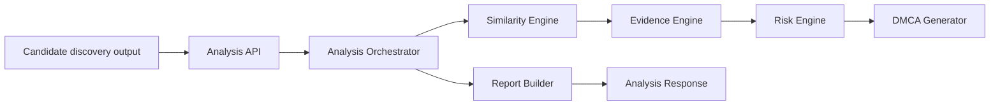

# Analysis Service Architecture (Dev B Phase 1)

Scope: Everything after candidate discovery. No similarity algorithms are defined here.

Handoff contract (current):

```json
{
  "original_article": "...",
  "candidates": [
    {
      "url": "...",
      "title": "...",
      "content": "...",
      "domain": "..."
    }
  ]
}
```

---

## 1. Architecture

High-level components:

- Analysis API: receives candidate discovery output and returns analysis results
- Analysis Orchestrator: coordinates similarity, evidence, risk, and DMCA modules
- Similarity Engine: pluggable strategies (exact, fuzzy, semantic)
- Evidence Engine: extracts matched passages and builds a report structure
- Risk Engine: produces a risk level based on similarity and evidence density
- DMCA Generator: produces a notice from evidence and risk assessment
- Report Builder: formats a report payload (JSON now, PDF later)
- Storage (optional): persistence for analysis runs and report snapshots

Key principles:

- Explicit contracts between modules (models first)
- Deterministic outputs for the same input
- Pluggable similarity strategies without changing the API
- No DB requirement for MVP; persistence is optional

---

## 2. Folder Structure

Proposed backend layout under `backend/analysis/`:

```
backend/
  analysis/
    __init__.py
    api/
      __init__.py
      routes.py               # FastAPI routes for analysis
    schemas/
      __init__.py
      requests.py             # AnalysisRequest, CandidateInput
      responses.py            # AnalysisResponse, CandidateAnalysis
      evidence.py             # Evidence models
      similarity.py           # Similarity contracts
    services/
      __init__.py
      orchestrator.py         # AnalysisOrchestrator interface
      risk_engine.py          # RiskLevel, RiskAssessment logic
      dmca_generator.py       # DMCA contract (no logic in Phase 1)
      report_builder.py       # Report payload contract
    engines/
      __init__.py
      similarity_engine.py    # SimilarityEngine protocol
    storage/
      __init__.py
      repository.py           # Optional persistence interface
```

Notes:

- No business logic in Phase 1; only contracts are defined.
- Evidence and similarity contracts are separated for clarity and testability.

---

## 3. Data Flow



Step-by-step:

1. API receives `AnalysisRequest` with original article and candidates.
2. Orchestrator requests similarity results for each candidate.
3. Evidence engine builds matched passages and summaries.
4. Risk engine produces a risk level for each candidate and overall.
5. DMCA generator builds a notice draft (text only for now).
6. Report builder packages response payload.

---

## 4. Service Boundaries

- Analysis API
  - Owns request validation and response formatting.
  - No similarity logic.
- Analysis Orchestrator
  - Controls pipeline ordering, retries, and timing.
  - Operates on typed models only.
- Similarity Engine
  - Interface-only in Phase 1.
  - Supports multiple strategies without API changes.
- Evidence Engine
  - Builds evidence from similarity output.
  - Stores match locations and metadata.
- Risk Engine
  - Converts similarity + evidence into `RiskLevel` and reasoning.
- DMCA Generator
  - Produces a draft notice based on evidence and risk.
- Report Builder
  - Formats JSON response (PDF later, via separate output).
- Storage (optional)
  - Store analysis results for later retrieval and report download.

---

## 5. Public Interfaces

Proposed external endpoints:

- `POST /api/v1/analyze`
  - Input: `AnalysisRequest`
  - Output: `AnalysisResponse`
  - Sync for MVP
- `GET /scan/{id}/results`
  - Output: `AnalysisResponse`
  - Reserved for async integration with discovery IDs
- `GET /report/{id}`
  - Output: report metadata + download URL (future PDF)
- `POST /dmca/generate`
  - Input: evidence + target info
  - Output: DMCA notice draft

Notes:

- `POST /api/v1/analyze` is the immediate handoff entrypoint.
- If `scan_id` is available, `GET /scan/{id}/results` maps to the same response model.

---

## 6. Request/Response Models

### AnalysisRequest

```json
{
  "original_article": "string",
  "candidate_articles": [
    {
      "url": "string",
      "title": "string | null",
      "content": "string",
      "domain": "string"
    }
  ],
  "options": {
    "min_similarity": 0.0,
    "max_candidates": 50,
    "enable_semantic": false
  }
}
```

### AnalysisResponse

```json
{
  "results": [
    {
      "candidate_url": "string",
      "candidate_title": "string | null",
      "domain": "string",
      "similarity_score": 0.0,
      "copied_percentage": 0.0,
      "breakdown": {
        "exact": 0.0,
        "fuzzy": 0.0,
        "semantic": 0.0
      },
      "risk_level": "low | medium | high"
    }
  ],
  "risk_assessment": {
    "risk_level": "low | medium | high",
    "confidence_score": 0.0,
    "reasoning": ["string"]
  },
  "evidence": {
    "total_candidates": 0,
    "total_matched_paragraphs": 0,
    "total_matched_sentences": 0,
    "high_confidence_matches": 0,
    "items": []
  }
}
```

Model notes:

- `breakdown` fields are optional until similarity strategies are implemented.

---

## 7. Acceptance Criteria

- Clear boundaries between API, orchestrator, similarity, evidence, risk, and DMCA modules.
- Request/response models are fully defined and consistent with the handoff contract.
- Public API endpoints are specified and map to the response model.
- No similarity algorithms or business logic included in Phase 1.
- Folder structure supports Phase 2-5 work without refactors.
- Contracts are serialization-friendly and deterministic.
